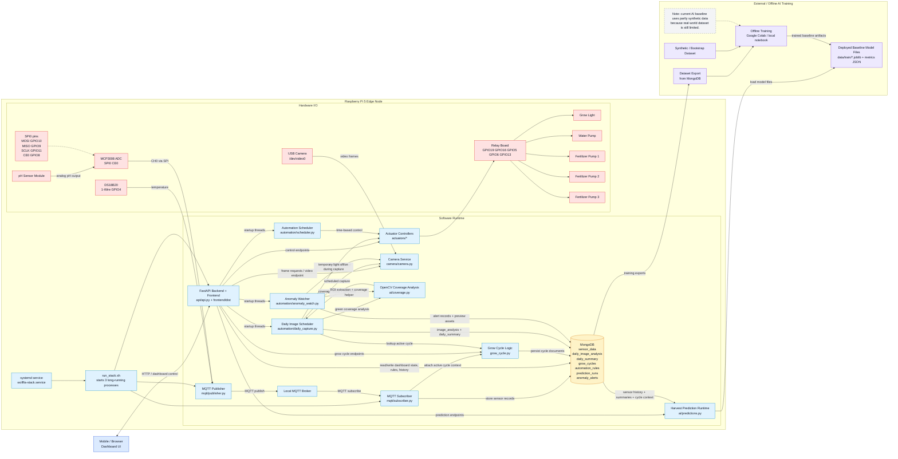

# Software-Hardware Architecture Diagram

This Mermaid diagram is based on the current codebase and runtime behavior of the project.

How to edit:
- update the Mermaid block below in any text editor
- preview in VS Code Mermaid/Markdown preview or paste into https://mermaid.live

